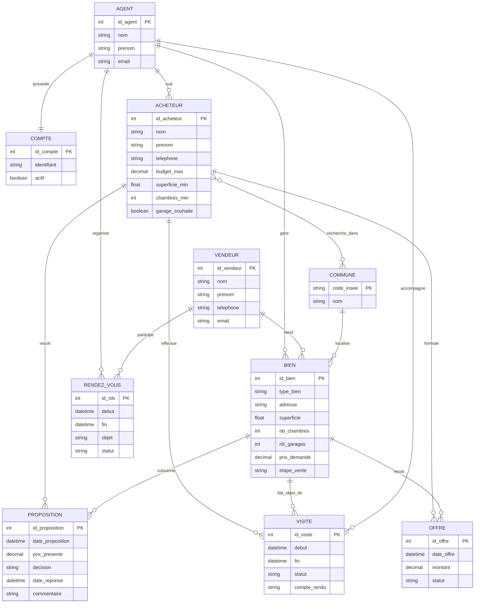

```mermaid

erDiagram
    direction TB

    AGENT {
        int id_agent PK
        string nom
        string prenom
        string email
    }

    COMPTE {
        int id_compte PK
        string identifiant
        boolean actif
    }

    VENDEUR {
        int id_vendeur PK
        string nom
        string prenom
        string telephone
        string email
    }

    ACHETEUR {
        int id_acheteur PK
        string nom
        string prenom
        string telephone
        decimal budget_max
        float superficie_min
        int chambres_min
        boolean garage_souhaite
    }

    COMMUNE {
        string code_insee PK
        string nom
    }

    BIEN {
        int id_bien PK
        string type_bien
        string adresse
        float superficie
        int nb_chambres
        int nb_garages
        decimal prix_demande
        string etape_vente
    }

    PROPOSITION {
        int id_proposition PK
        datetime date_proposition
        decimal prix_presente
        string decision
        datetime date_reponse
        string commentaire
    }

    VISITE {
        int id_visite PK
        datetime debut
        datetime fin
        string statut
        string compte_rendu
    }

    RENDEZ_VOUS {
        int id_rdv PK
        datetime debut
        datetime fin
        string objet
        string statut
    }

    OFFRE {
        int id_offre PK
        datetime date_offre
        decimal montant
        string statut
    }

    AGENT ||--|| COMPTE : possede
    AGENT ||--o{ BIEN : gere
    VENDEUR ||--o{ BIEN : vend
    COMMUNE ||--o{ BIEN : localise

    AGENT ||--o{ ACHETEUR : suit
    ACHETEUR }o--o{ COMMUNE : recherche_dans

    ACHETEUR ||--o{ PROPOSITION : recoit
    BIEN ||--o{ PROPOSITION : concerne

    ACHETEUR ||--o{ VISITE : effectue
    BIEN ||--o{ VISITE : fait_objet_de
    AGENT ||--o{ VISITE : accompagne

    AGENT ||--o{ RENDEZ_VOUS : organise
    VENDEUR ||--o{ RENDEZ_VOUS : participe

    ACHETEUR ||--o{ OFFRE : formule
    BIEN ||--o{ OFFRE : recoit
```