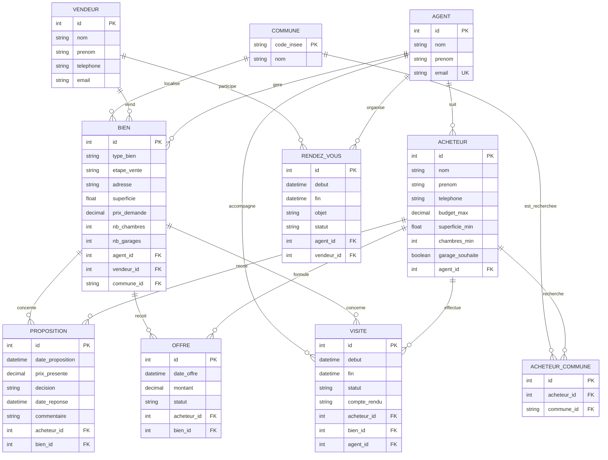

```mermaid
erDiagram
    direction TB

    AGENT {
        int id PK
        string nom
        string prenom
        string email UK
    }

    VENDEUR {
        int id PK
        string nom
        string prenom
        string telephone
        string email
    }

    COMMUNE {
        string code_insee PK
        string nom
    }

    BIEN {
        int id PK
        string type_bien
        string etape_vente
        string adresse
        float superficie
        decimal prix_demande
        int nb_chambres
        int nb_garages
        int agent_id FK
        int vendeur_id FK
        string commune_id FK
    }

    ACHETEUR {
        int id PK
        string nom
        string prenom
        string telephone
        decimal budget_max
        float superficie_min
        int chambres_min
        boolean garage_souhaite
        int agent_id FK
    }

    ACHETEUR_COMMUNE {
        int id PK
        int acheteur_id FK
        string commune_id FK
    }

    PROPOSITION {
        int id PK
        datetime date_proposition
        decimal prix_presente
        string decision
        datetime date_reponse
        string commentaire
        int acheteur_id FK
        int bien_id FK
    }

    VISITE {
        int id PK
        datetime debut
        datetime fin
        string statut
        string compte_rendu
        int acheteur_id FK
        int bien_id FK
        int agent_id FK
    }

    RENDEZ_VOUS {
        int id PK
        datetime debut
        datetime fin
        string objet
        string statut
        int agent_id FK
        int vendeur_id FK
    }

    OFFRE {
        int id PK
        datetime date_offre
        decimal montant
        string statut
        int acheteur_id FK
        int bien_id FK
    }

    AGENT ||--o{ BIEN : gere
    VENDEUR ||--o{ BIEN : vend
    COMMUNE ||--o{ BIEN : localise
    AGENT ||--o{ ACHETEUR : suit

    ACHETEUR ||--o{ ACHETEUR_COMMUNE : recherche
    COMMUNE ||--o{ ACHETEUR_COMMUNE : est_recherchee

    ACHETEUR ||--o{ PROPOSITION : recoit
    BIEN ||--o{ PROPOSITION : concerne

    ACHETEUR ||--o{ VISITE : effectue
    BIEN ||--o{ VISITE : concerne
    AGENT ||--o{ VISITE : accompagne

    AGENT ||--o{ RENDEZ_VOUS : organise
    VENDEUR ||--o{ RENDEZ_VOUS : participe

    ACHETEUR ||--o{ OFFRE : formule
    BIEN ||--o{ OFFRE : recoit
```